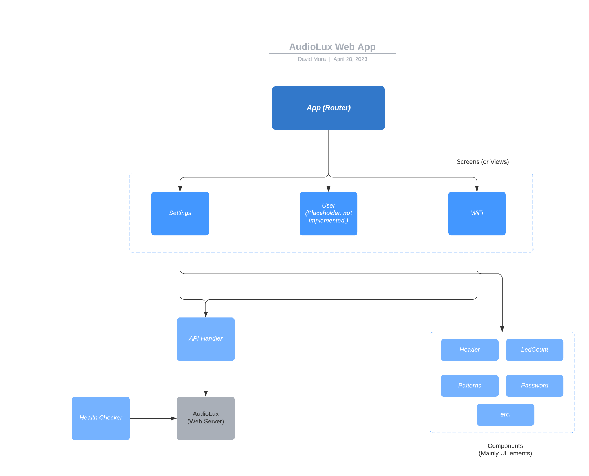

# AudioLux WebApp

Presents a graphical user interface allowing the configuration of the device. 
The application is served by a web server in the firmware. Once running, the
application will communicate with the embedded server through an API.

## Architecture

The application is very simple and based on [Preact.js](https://preactjs.com/), a minified version of React. 
Even though it is very small, Preact.js provides all the main functionality of its big
sibling. There is not enough complexity in the application to merit it being implemented
in a MVVM or MVC pattern. There is no model. Nonetheless, a modest effort is invested in
providing some decoupling and modularization.

This is a high level view of the current implementation:



## Building the Web App

To get started, you will need node and npm installed in your system. Currently, the build
process is based on Node.js version 14.17.1 and npm version 6.14.13. If you don't have node 
in your system consult the 
[official installing guide](https://docs.npmjs.com/downloading-and-installing-node-js-and-npm). It 
is highly suggested that you use a node version manager like 
[nvm](https://github.com/creationix/nvm) (or [nvm-windows](https://github.com/coreybutler/nvm-windows)).
Check the [install guide](https://www.freecodecamp.org/news/node-version-manager-nvm-install-guide/) for
more information.

Once you have node and npm in your system, clone the repo, go to the WebApp folder and use the CLI
commands below to install, build, and run the application.


### CLI Commands

```bash
# install dependencies
npm install

# serve with hot reload at localhost:8080
npm run dev

# build for production with minification
npm run build

# test the production build locally
npm run serve

# run tests with jest and enzyme
npm run test
```

For detailed explanation on how things work, checkout the [CLI Readme](https://github.com/developit/preact-cli/blob/master/README.md).

## Uploading the app to the AudioLux device

The Web App is completely separate from the firmware that runs on the AudioLux device. Once the Web App is
built, it must be transferred to the device where it is saved in a memory partition that is configured
as persistent storage with a simple file system.

The web is build for deployment using the `npm run build` command as mentioned above. Once done the
app files will be located in a `build` directory of the Web App folder. The following files and folders
must be copied to the device:

 - The `assets` folder and its contents.
 - All the `.js` and `.json` files.
 - All the `.css` files.

Do _not_ copy the map files. Do _not_ copy the ssr-build folder.

Check the wiki for 
[instructions on how to do send the web app to the device](https://github.com/OPEnSLab-OSU/Nanolux/wiki/Setting-up-the-file-system-for-the-Web-App).

>NOTE: deploying the app to the device will delete any state saved to disk. That is, all settings will
revert to defaults and the device will its current WiFi configuration.
